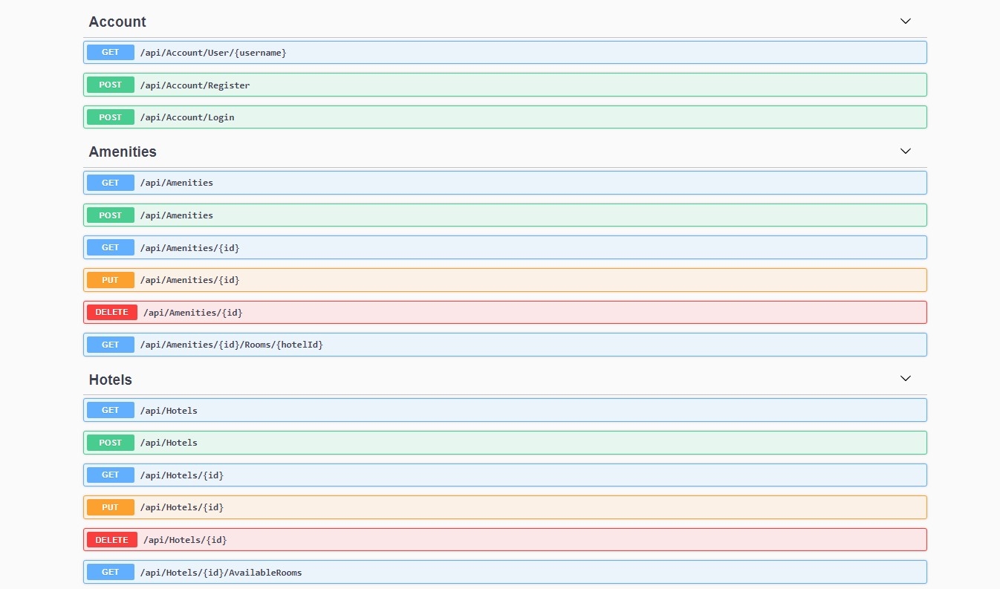
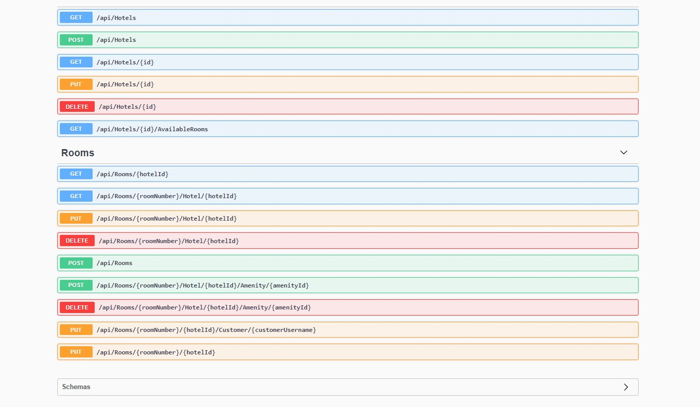

# Hotel Management System API

Building a ```RESTful API``` hotel server that will increase the managmement of the assets in a hotel. Also, increase the ability to modify and manage rooms, amenities, customers, booking rooms, and more.

*Note: This project has ```JWT``` authentication, and contains ```swagger``` page as first page.*

## Live Demonstration on Azure

The API demo can be viewed online [HERE](https://hotelmgtapi.azurewebsites.net/swagger/index.html)

<br>

## Table of content
|No.|Content|
|:---:|:------|
|1|[Get Started](#get-started)|
|2|[Overview](#overview)|
|3|[Account Endpoints](#account-endpoints)|
|4|[Hotels Endpoints](#hotel-endpoints)|
|5|[Rooms Endpoints](#room-endpoints)|
|6|[Amenities Endpoints](#amenities-endpoints)|
|6|[Swagger Page](#swagger-page)|

<br>

## Get Started
To get started you can simply clone this ecommerce-demo repository and install the dependencies.

1. Clone the ecommerce-demo repository using git:

```cmd
git clone https://github.com/hmza-smha/hotel_api.git
cd hotel_api
```

2. Update the database using NuGet-package manager console:

```
Update-Database
```

<br>

## Overview

This API allows you to 

- CREAT, READ, UPDATE, and DELETE a **Hotels**, **Rooms**, or an **Amenities**.
- Add/Remove a **Room** to/from a **Hotel**.
- Add / Remove a **Amenity** to/from a **Room**.
- Get all available (not booked) **Rooms** from a **Hotel**.
- Book / Remove booking a **Room** by a **Customer**.
- Get All **Rooms** contaions a specific **Aminity**
- Register / Log in a **User/Customer**.
- Get a **User/Customer** information.

<br>


## Account Endpoints

|Method|Endpoint|Descreption|
|:-----|:-------|:----------|
|```GET```| ~​/api​/Account​/User​/{username} | Get all a **Customer** information |
|```POST```| ~​/api​/Account​/Register | Register a new **Customer** information |
|```POST```| ~​/api​/Account​/Login | Login **Customer** |

<br>

## Hotel Endpoints

**CRUD**

|Method|Endpoint|Descreption|
|:-----|:-------|:----------|
|```GET```|~/api/Hotels | Get all **Hotels** in the database, with it's **Rooms** |
|```GET```|~/api/Hotels/{id} | Get a specifi **Hotel** from the database, with it's **Rooms**|
|```POST```| ~/api/Hotels| Add a new **Hotel** |
| ```PUT```| ~/api/Hotels/{id}| Update an existing **Hotel** |
|```DELETE```| ~/api/Hotels/{id}| Remove a **Hotel** from the database |

|Method|Endpoint|Descreption|
|:-----|:-------|:----------|
|```GET```|~/api/Hotels/{id}/AvailableRooms | Get all available **Rooms** for booking in a specific **Hotel** |

<br>

## Room Endpoints

**CRUD**

|Method|Endpoint|Descreption|
|:-----|:-------|:----------|
|```GET```|~​/api​/Rooms​/{hotelId} | Get all **Rooms** in a specific **Hotel** |
|```GET```|~​/api​/Rooms​/{roomNumber}​/Hotel​/{hotelId} | Get a specific **Room** from a specific **Hotel**|
|```POST```| ~​/api​/Rooms| Add a new **Room** |
| ```PUT```| ~​/api​/Rooms​/{roomNumber}​/Hotel​/{hotelId}| Update an existing **Room** |
|```DELETE```| ~​/api​/Rooms​/{roomNumber}​/Hotel​/{hotelId}| Remove a **Room** from a **Hotel** |


**Add/Remove a specific Amenity to a specific Room**

|Method|Endpoint|Descreption|
|:-----|:-------|:----------|
|```POST```|~​/api​/Rooms​/{roomNumber}​/Hotel​/{hotelId}​/Amenity​/{amenityId} | Add a specific **Amenity** to a specific **Room** |
|```DELETE```| ~​/api​/Rooms​/{roomNumber}​/Hotel​/{hotelId}​/Amenity​/{amenityId}| Remove a specific **Amenity** from a specific **Room** |

**Book/Remove booking a room by customer:**

|Method|Endpoint|Descreption|
|:-----|:-------|:----------|
|```PUT```|~​/api​/Rooms​/{roomNumber}​/{hotelId}​/Customer​/{customerUsername} | Book a **Room** by **Customer** |
|```PUT```|~​/api​/Rooms​/{roomNumber}​/{hotelId}| Free a **Room** from a **Customer** |


<br>

## Amenities Endpoints

**CRUD**

|Method|Endpoint|Descreption|
|:-----|:-------|:----------|
|```GET```| ~​/api​/Amenities | Get all **Amenities** in the database, and the **Rooms** which has these **Amenity** |
|```GET```| ~​/api​/Amenities​/{id} | Get a specific **Amenity**, and the **Rooms** which has these **Amenity**|
|```POST```| ~​/api​/Amenities| Add a new **Amenity** |
| ```PUT```| ~​/api​/Amenities​/{id}| Update an existing **Amenity** |
|```DELETE```| ~​/api​/Amenities​/{id}| Remove an **Amenity** from a the database |

**Get all rooms contains a specific amenity in a specific hotel**

|Method|Endpoint|Descreption|
|:-----|:-------|:----------|
|```GET```| ~​/api​/Amenities​/{id}​/Rooms​/{hotelId} | Get all **Rooms** contains a specific **Amenity** in a specific **Hotel**|

<br>

## Swagger Page


